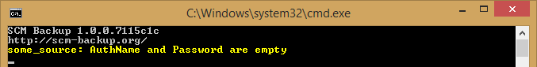

GitHub
======

Configuration settings for backing up repositories from GitHub.

.. warning::

    **Known limitations:**
    
    - `Issues are not backed up <https://github.com/christianspecht/scm-backup/issues/12>`_

Sources
-------

For the basics, please read the :ref:`config-sources` section first.

For GitHub, the ``hoster`` entry in the config file needs to look like this::

    hoster: github

Authentication
--------------

Without authentication, SCM Backup can only backup your public repositories.

In this case, it shows a warning:

To backup your private repositories as well, you need to authenticate:

- To backup a user's repositories, you need to authenticate with that user.
- To backup an organization's repositories, you need to authenticate with a user who has sufficient permissions to that organization's repositories.

Create a `personal access token <https://github.com/blog/1509-personal-api-tokens>`_ for SCM Backup for that user:

#. In the user's settings on GitHub, `create a new token <https://github.com/settings/tokens/new>`_. Give it at least the ``repo:status`` scope.
    
    This scope allows SCM Backup to get a list of that user's repositories via the `GitHub API <https://developer.github.com/v3/>`_ (`read more about scopes <https://developer.github.com/apps/building-oauth-apps/scopes-for-oauth-apps/>`_).
    
#. Put the username and the token into the ``authName`` and ``password`` properties of the source in the config file.

    Example::
        
        sources:

          - title: some_title
            hoster: github
            type: org
            name: your_org_name
            authName: your_user_name
            password: your_token
            
    This will backup the repositories of the organization ``your_org_name``, but authenticate with the user ``your_user_name``.
