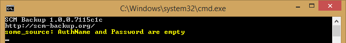

Configuration
=============

SCM Backup is configured in `YAML <https://en.wikipedia.org/wiki/YAML>`_, by editing the config file ``settings.yml``.

.. note::

    SCM Backup automatically makes a backup of its own configuration.
    
    On each run, the following files are copied to the :ref:`backup folder <config-folder>`, into a subfolder named ``_config``:
    
    - ``settings.yml``
    - The :doc:`logger's <output-logging>` config file
    

General Options
---------------

.. _config-folder:

localFolder
+++++++++++

The folder (on the machine where SCM Backup runs) where all the backups will be stored.

The folder must already exist, SCM Backup won't create it.

Windows example::

    localFolder: 'c:\scm-backup'

MacOS example::

    localFolder: '/Users/yourusername/scm-backup/'

    
waitSecondsOnError
++++++++++++++++++

When an error occurs, SCM Backup will wait that many seconds before exiting the application.

Example::
    
    waitSecondsOnError: 5

.. _config-scms:

scms
++++

SCM Backup uses the source control software already installed on your system. By default, it assumes that the required SCMs are installed in your path.

If this isn't the case, or if you have multiple versions of the same SCM on your system and want SCM Backup to use a specific one, you can specify the complete path to the executable in the config file.

Example::

    scms:
      - name: git
        path: 'c:\git\git.exe'

    
.. _config-email:

email
+++++

Settings for :doc:`sending log information via email <output-email>`.

By default, the whole section is commented out via ``#``. To enable it, remove the comments so it looks like this::

    email:
      from: from@example.com
      to: to@example.com
      server: smtp.example.com
      port: 0
      useSsl: false
      userName: testuser
      password: not-the-real-password

Fill all settings with the proper values for your server.

SCM Backup will try sending emails when an un-commented ``email`` section exists in the configuration.

.. _config-sources:

Sources
-------

SCM Backup is able to backup from multiple source code hosters, and multiple accounts per hoster.

For example, your GitHub user may be a member of an `organization <https://help.github.com/articles/about-organizations/>`_, and you may want to backup all repositories of your user, **and** all repositories of that organization.

In SCM Backup terms, these would be two different **sources**: your GitHub user would be one source, and the organization would be a second one.

You can define as many sources as you want in the config file, in this format::

    sources:

      - title: some_title
        hoster: github
        type: user
        name: your_user_name

      - title: another_title
        hoster: github
        type: org
        name: your_org_name

Each source must have at least those four properties:
        
``title``

    Must be unique in the whole config file.

    For each source, SCM Backup will create a sub-folder named like the source's title in the :ref:`main backup folder <config-folder>`.
    
``hoster``

    The source code hoster from which you want to backup. See the sub-pages for valid values for each hoster.

``type``

    Either ``user`` or ``org``, depending if you want to backup an user or a organization.

``name``

    The name of the user/organization you want to backup.

.. warning:: With these settings, SCM Backup will backup public repositories only. For private repositories, additional properties must be set ⇒ see :ref:`config-auth`

See the respective sub-page for detailed documentation per hoster:

.. toctree::
   :maxdepth: 2
   :glob:

   config-*

.. _config-ignorerepos:

ignoreRepos
+++++++++++

Optional: For each source, you can specify a list of repositories you do **not** want to be backed up.

Example::

    sources:

      - title: some_title
        hoster: github
        type: user
        name: your_user_name
        ignoreRepos:
            - repo1
            - Some-Other-Repo

.. note::

    - The repository names are case-sensitive!
    - For hosters where the repositories are "sub-items" of the users (like GitHub), you just need to specify the repository name, not the user name (i.e. ``repo`` instead of ``user/repo``).

includeRepos
++++++++++++

Optional. The opposite of ``ignoreRepos`` *(see above)*: if a list of repos is specified in ``includeRepos``, **only these repos will be backed up, the rest will be ignored**.

Example::

    sources:

      - title: some_title
        hoster: github
        type: user
        name: your_user_name
        includeRepos:
            - repo1
            - Some-Other-Repo

.. note:: When the same repo is specified in both ``ignoreRepos`` and ``includeRepos``, ignoring "wins" and the repo will **not** be backed up.

.. _config-auth:

Authentication
--------------

Without authentication, SCM Backup can only backup your public repositories.

In this case, it shows a warning:

To backup your private repositories as well, you need to authenticate by setting two more properties for the source:

``authName``

    Name of the user which is used for authentication.
    
``password``

    The password/token/whatever (this varies wildly depending on the source code hoster)

.. note::

    If your password contains at least `one of the special characters listed here <https://stackoverflow.com/a/22235064/6884>`_, you should enclose it in quotes.
    
    E.g. ``password: 'foo?'`` instead of ``password: foo?``
    
    
    
If you don't want to save your passwords directly in a config file, SCM Backup is able to get them from environment variables.

Example::

    password: '%some_variable%'

If an environment variable named ``some_variable`` exists, the string ``%some_variable%`` will be replaced by the value of that variable.

This works for parts of the password as well::

    password: 'foo%some_variable%bar'

.. note::
    
    If you use environment variables, you **must** quote the string as shown in the examples above.
    
    ``password: %some_variable%`` will not work because in YAML, strings containing ``%`` must always be quoted.
                

Special Options
---------------

Additional configuration options, available in this form::

	options:
		CATEGORY:
			KEY : VALUE

removeDeletedRepos
++++++++++++++++++

::

	options:
		backup:
			removeDeletedRepos : false
			
Default value: ``false``

SCM Backup will detect repositories which exist in the local backup, but not at the hoster...so at some point, they were deleted from the hoster.

When ``removeDeletedRepos`` is set to true, SCM Backup will delete those repositories from the local backup folder.

.. _config-logrepofinished:

logRepoFinished
++++++++++++++++++

::

	options:
		backup:
			logRepoFinished: false
			
Default value: ``false``

While SCM Backup is running, it outputs a log message for each repo that is backed up::

	Backing up source: some_source
	Git: https://github.com/some_user/some_repo.git 
	Git: https://github.com/some_user/another_repo.git 
	...

These messages are generated **before** SCM Backup tries to backup the repo, but that's not obvious for the user just by looking at the messages.

To make it more clear when the backup of each repo starts and finishes *(e.g. when an error happens, to be 100% sure which repo caused it)*, you can set ``logRepoFinished`` to true, which outputs a second log message for each repo when its backup is finished::

	Backing up source: some_source
	Git: https://github.com/some_user/some_repo.git 
	     Finished
	Git: https://github.com/some_user/another_repo.git 
	     Finished
	...

