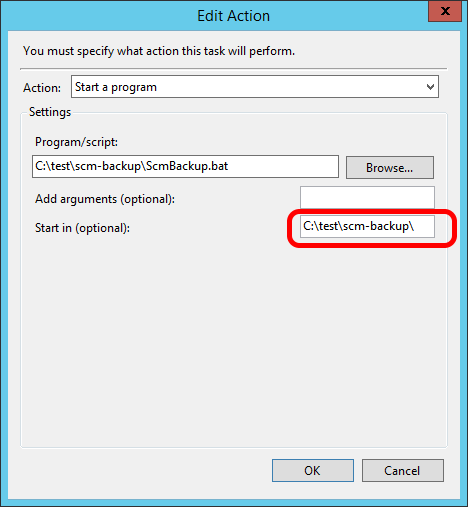

Installation
============

.. _install-requirements:

System Requirements
-------------------

.NET Core
+++++++++

SCM Backup is written in `.NET Core <https://dotnet.github.io/>`_, the cross-platform version of .NET.

The available releases are `framework-dependent deployments <https://docs.microsoft.com/en-us/dotnet/core/deploying/>`_, which means that the same download should work on any Windows, Linux and MacOS machine, as long as .NET Core is installed on it.

If it's not on your machine, you can get it from the `official download page <https://dotnet.microsoft.com/en-us/download/dotnet/3.1>`_:

- Install **any version 3.1.x** of the .NET Core **runtime** *(not the SDK)*
- SCM Backup is a console app, so the .NET Runtime is sufficient

  *(the ASP.NET Core Runtime or .NET Desktop Runtime will also work, but contain more than SCM Backup needs)*

.. note::

    So far, SCM Backup has been written on Windows only. Technically, it should run on Linux and MacOS as well.
    
    CI (including tests) is also `running on Linux <https://github.com/christianspecht/scm-backup/actions/workflows/ci-linux.yml>`_, and we *know* that there are users on Linux and MacOS.

Source control software
+++++++++++++++++++++++

SCM Backup doesn't come with its own versions of `Git <https://git-scm.com/>`_ and/or `Mercurial <https://www.mercurial-scm.org/>`_, so the respective SCM needs to be installed on your machine if you have at least one repository of the given type.

By default, SCM Backup expects all source control software to be in your path, so it just needs to execute ``git``, ``hg`` etc. without a complete path, although it's possible to :ref:`specify the path to the executable in the config <config-scms>`.

Note that at runtime, SCM Backup checks the presence of all required SCMs on your system. It will stop if you have repositories needing a SCM which is not present on your system.

Download
--------

At the moment, there are only .zip downloads.

Download the .zip file from `the latest release <https://github.com/christianspecht/scm-backup/releases/latest>`_ and unzip it into a folder of your choice.

How to run
----------

.. warning::

    You should edit the configuration file before running SCM Backup for the first time!
    
    :doc:`Read the guide </config>` for more information.

Run the actual application by executing ``ScmBackup.exe`` 

Windows Task Scheduler
++++++++++++++++++++++

To run SCM Backup via Windows Task Scheduler, you need to specify the path to the exe **and** the directory (in "Start in") in the "Edit Action" screen:

Omitting the directory `can cause problems <https://github.com/christianspecht/scm-backup/issues/30>`_.

Docker
++++++

It's possible to run SCM Backup via Docker, but I *(SCM Backup maintainer)* don't have much Docker experience.

Here are some example Dockerfiles from people who managed to get it to run. I'm not able to provide support for this - use at your own risk!

- `Dockerfile by norbdev <https://github.com/christianspecht/scm-backup/issues/51>`_
- `Dockerfile by juris <https://github.com/christianspecht/scm-backup/issues/49#issuecomment-830032953>`_
- `Pre-made Docker image by Juro <https://hub.docker.com/r/juroapp/scm-backup>`_ [#prebuilt]_

.. rubric:: Footnotes

.. [#prebuilt] This is a pre-built container, but the build script that was used to make this image is not published. Before using it, you should validate that it contains nothing unexpected *(or if you're not sure, use one of the Dockerfiles instead)*. For more information, read `this <https://github.com/christianspecht/scm-backup/issues/67>`_.
